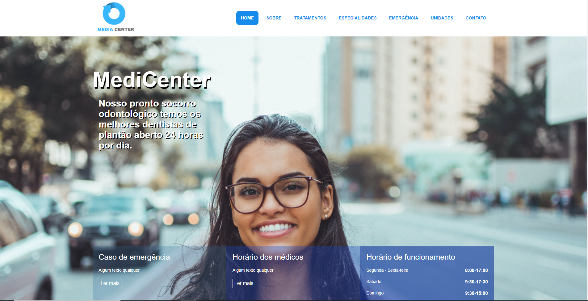
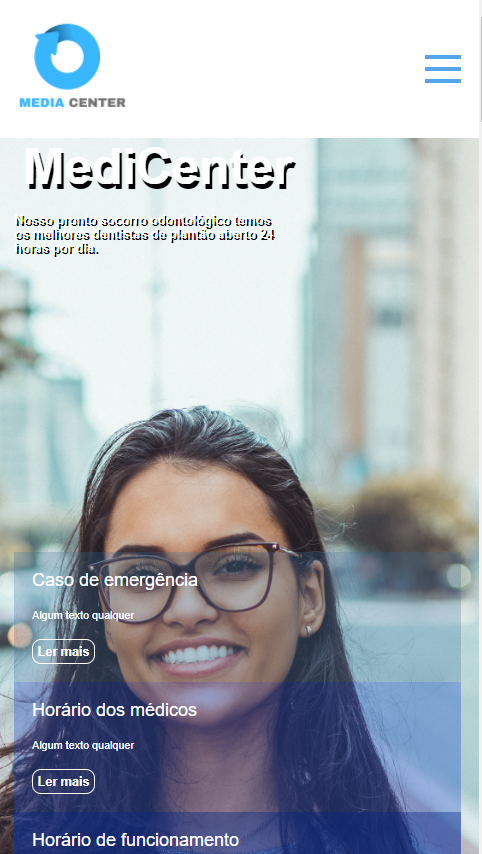

<h1>Projeto Final Medicenter</h1>
        
Projeto feito no curso  <strong>{Parças} Developers School®</strong> 

        <h2> Versão desktop</h2>
        <a style="text-decoration:none;color:#0EAA23 " href="https://medicenter-aironys.netlify.app/" target="_blank" title="Projeto Final Medicenter">Ver Projeto
        
        </a>

<h2> Versão Mobile</h2>
        <a style="text-decoration:none; #2971EC" href="https://medicenter-aironys.netlify.app/" target="_blank" title="Projeto Final Medicenter">Ver Projeto
        
        </a>

